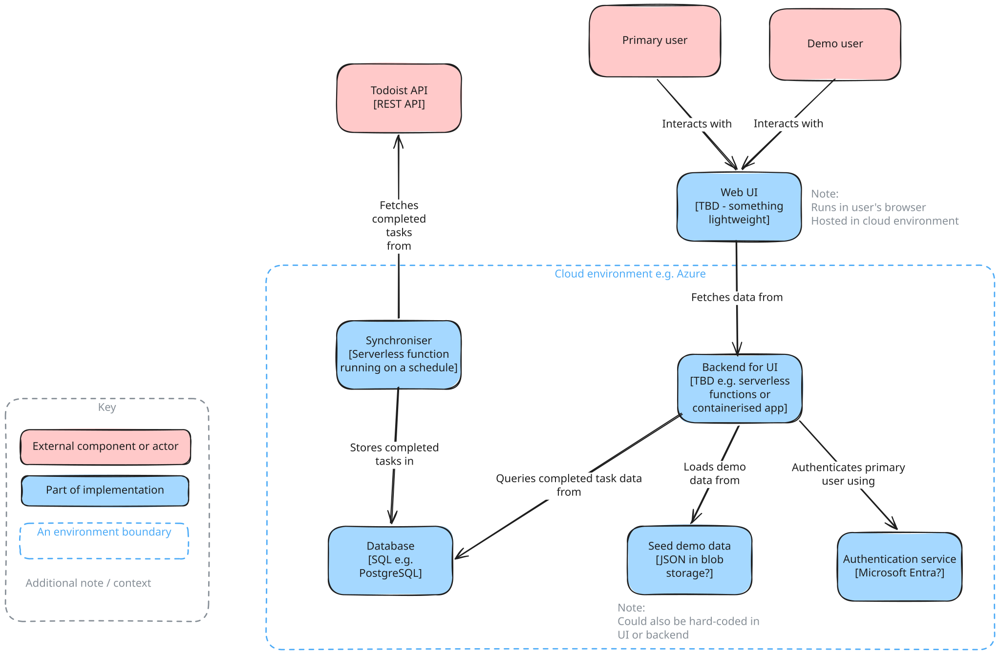

# Initial high level design

## Scope (copied from readme)

This project is done when:

- Completed tasks are retrieved from Todoist's API
- A frontend displays a GitHub-style heat map and current streak
- Real data is protected by authentication
- A demo mode seeds fake data for anyone viewing the public URL
- Running in Azure with IaC and continuous deployment

Everything beyond this is optional.

## Functional requirements

### MVP

- The primary user should be able to see their current streak
- The system shall calculate the streak in the following way:
  - The number of consecutive days where at least one task has been completed, counting back from today
  - If no tasks have been completed today, today is not counted towards the streak but the streak isn't considered "broken" i.e. it doesn't reset to 0
- The primary user should be able to see a heat map, similar to GitHub contributions or the heat map in Anki's stats tab that shows how many tasks they've completed per day over the past year
- Demo users should be able to view a "demo" mode (populated with fake data) that allows them to see how the system works and displays data
- The system shall require authentication to see real data
- All users should see statistics based on their browser's timezone
- Demo users should not be able to see the primary user's real tasks
- The system should periodically sync completed tasks from the Todoist API (e.g. every 15 minutes)

### Beyond MVP

- The user should be able to manually refresh to sync against Todoist

## Non-functional requirements

### CAP / Consistency vs availability

- Eventual consistency with respect to accurately reflecting Todoist state is acceptable
- High availability is currently unnecessary. It's a side project with infrequent usage patterns so some downtime is tolerable and likely to go unnoticed.
  - Availability could become more important if reliable demo access becomes a priority later

### Scalability

- Only needs to support a single user with real data
- Needs to support a very minimal (generally zero) number of demo users

### Traffic patterns / read/write symmetry

- Usage by primary user will be at most a few times a day
- Usage by demo users is likely less often than once a month
  - This is so low it could be bumped from the MVP if necessary

### Environmental constraints

- Backend infrastructure will run in a public cloud environment, ideally utilising what's available on the free tier
- UI will run in a web browser

### Security and compliance

- Todoist credentials need to be stored securely (location TBD later)
- Primary user needs secure authentication
- GDPR compliance is out of scope - the system stores data for a single known user (the owner) only

### Data durability

- Not important for MVP as data can be resynced from Todoist

### Latency vs throughput

- Not a concern at this stage due to current scale

## High level design of a functional system

Note this is a first-pass and may change as I do more research

### Explanation of initial design

#### Todoist API

| Options | Pros | Cons | Outcome |
| --- | --- | --- | --- |
| REST API | Relatively simple. Can query by date. | Requires polling | 🚧 Good option - prototype and compare |
| REST API's Sync Endpoint | Designed for syncing data. Supports incremental syncing. Used by Todoist's own app. | Requires polling | 🚧  Good option - prototype and compare |
| Webhooks | Event-driven / no polling needed. Can subscribe to relevant events. | More complex setup. Requires a public HTTPS endpoint. Requires use of OAuth flow to use. | 🔮 Potential future improvement for better consistency and to avoid polling |
| Python and Node.js SDKs | Simpler - abstraction layer over REST API | Limited to Python and Node. I would prefer to use Golang. | ❌ Ruled out |
| CLI | | N/A - don't plan to run from shell | ❌ Ruled out |
| Agent skills / MCP | | N/A - don't plan to use agentic AI | ❌ Ruled out |

#### Synchroniser

| Options | Pros | Cons | Outcome |
| --- | --- | --- | --- |
| Serverless function | Scale to zero / saves compute / cost-efficient. Good fit for trigger on schedule / ad-hoc (for manual sync). Good fit with free tier requirement. | Cold start latency. Only an issue for an ad-hoc sync triggered on user request | ✅ Preferred approach |
| PaaS (e.g. Azure App Service) | Relatively little ops overhead. | More appropriate for long-running app. Would need to handle schedule myself. Wasted compute / cost. | ❌ Ruled out |
| Containerised app | Simple. Familiar workflow. Portable. | Will need to manage triggers / schedule. Wasted compute / cost. Need to manage container runtime and health-checks. Overkill. | ❌ Ruled out |
| App running on VM | | Ops overhead. Don't need this much control. Wasted compute / cost. Overkill. | ❌ Ruled out |

#### Database

| Options | Pros | Cons | Outcome |
| --- | --- | --- | --- |
| | | | |

#### Web UI

| Options | Pros | Cons | Outcome |
| --- | --- | --- | --- |
| | | | |

#### Backend for UI

| Options | Pros | Cons | Outcome |
| --- | --- | --- | --- |
| | | | |

#### Authentication service

| Options | Pros | Cons | Outcome |
| --- | --- | --- | --- |
| | | | |

#### Seed demo data

| Options | Pros | Cons | Outcome |
| --- | --- | --- | --- |
| | | | |

